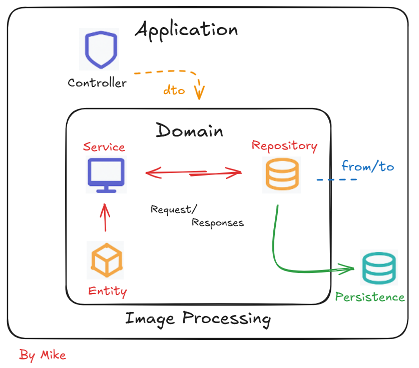
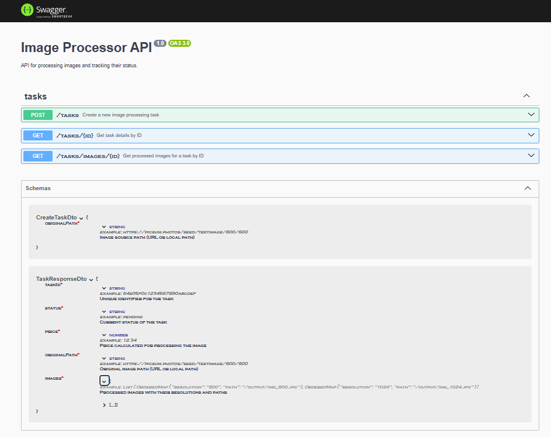

# Image Processor API

This project is an API built with **NestJS**, **MongoDB**, and **Sharp**, enabling asynchronous image processing from remote URLs or local paths.

It allows creating processing tasks, resizes images to multiple resolutions, saves them locally, and persists metadata in MongoDB.

---

## Tech Stack

- **NestJS** + TypeScript
- **MongoDB** with Mongoose
- **Hexagonal Architecture** (Domain / Application / Infrastructure)
- **Sharp** (image processing)
- **Swagger** (API documentation)
- **Jest** (unit testing)
- **Class-validator** / Custom Pipes
- **Dotenv** (env config)
- **ServeStatic** (static access to images)

---

## Getting Started

### 1. Clone the repository

```bash
git clone https://github.com/Micharcg8/image-processor-api.git
cd image-processor-api
```

### 2. Install dependencies

```bash
npm install
```

### 3. Setup environment

Create a `.env` file in the root of the project:

```
MONGODB_URI=mongodb://localhost:27017/image_processor
PORT=3000
```

### 4. Start MongoDB

Ensure MongoDB is running. If using Docker:

```bash
docker run --name image-db -p 27017:27017 -d mongo
```

### 5. Run the application

```bash
npm run start:dev
```

### 6. Access Swagger documentation

Go to: [http://localhost:3000/api](http://localhost:3000/api)

---

## Project Structure

```
src/
├── app.module.ts
├── main.ts
│
├── domain/
│   ├── entities/
│   │   └── task.entity.ts
│   └── repositories/
│       └── task.repository.ts
│
├── infraestructure/
│   └── repositories/
│       └── mongoose-task.repository.ts
│
├── tasks/
│   ├── tasks.controller.ts
│   ├── tasks.service.ts
│   ├── tasks.module.ts
│   ├── dto/
│   │   └── create-task.dto.ts
│   └── schemas/
│       └── task.schemas.ts
│
├── shared/
│   ├── pipes/
│   │   └── validate-object-id.pipe.ts
│   ├── validators/
│   │   └── is-valid-original-path.ts
│   └── utils/
│       ├── download-image.ts
│       └── get-md5.ts
```

---

## Running Tests

```bash
npm run test
```

Or with coverage:

```bash
npm run test:cov
```

Also with e2e:
> **Note:** Make sure MongoDB is running locally at `mongodb://localhost:27017` before running the E2E tests.


```bash
npm run test:e2e
```

### Tests Included

- `TasksService`
- `TasksController`
- Pipes (`ValidateObjectIdPipe`)
- Validators (`IsValidOriginalPath`)
- Utilities (`download-image.ts`, `get-md5.ts`)
- Repository (`MongooseTaskRepository`)

---

## How It Works

1. **POST /tasks**  
   - Receives `originalPath` (URL or local path).
   - Creates a task in MongoDB.
   - Launches a background process to resize to 1024px and 800px.
   - Saves images in `/output`.

2. **GET /tasks/:id**  
   - Returns task status, price, and image paths.

3. **GET /tasks/images/:id**  
   - Returns only the processed images.

---

## Example Payload

```json
{
  "originalPath": "https://picsum.photos/seed/testimage/800/600"
}
```

---

## Validations and Error Handling

- Invalid ObjectId: handled by a custom Pipe
- `originalPath`:
  - Must be a valid `http/https` URL or an existing local file
- Missing tasks return `404`
- Processing errors are captured and marked as `failed`

---
## Diagram Api



---

## Development Notes

- Modular code, follows SOLID principles
- Linting and formatting applied
- Env variables externalized
- Static files available at `/output`
- Hexagonal architecture implemented (Domain, Infra, App)

---

## Swagger Preview



---

## Possible Improvements

- Add authentication
- Persistent processing logs
- Retry strategy for failures
- Upload processed images to services like AWS S3

---

## Author

Michael (Software Engineer)
